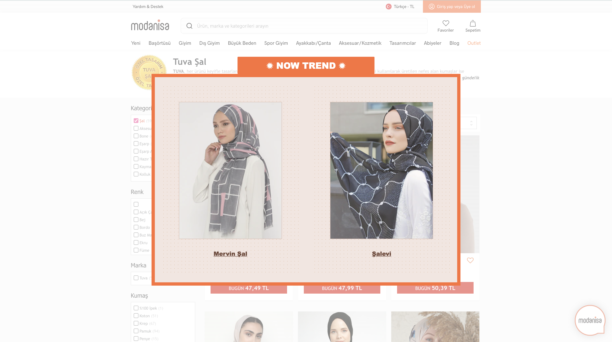

# WEEK 1 HTML-CSS-JAVASCRİPT ASSİGNMENT (1)


<br />

## **TITLES**
---
* [Description](#description)
* [Technologies](#technologies)
* [Setup](#setup)
* [Sources](#sources)

<br />


## Description
---
This project is the UI design of a login page. \
Using CSS flexbox, the entire login card is aligned in the middle of the page, and the elements inside are grouped into columns. \
The flexbox of the entire login card is column, it contains a total of 2 rows. These rows are also divided into columns according to necessity. \
As for the promotion of the login card; it has the title "Login". \
In addition, there are 2 text inputs to get the username and password from the user. And there is a button for the login process, links that lead to the relevant pages for "forgot password" and "sign up" actions.

<br/>

## Technologies
---
Project is created with:
* **HTML5**
* **CSS3**


<br />


# WEEK 1 HTML-CSS-JAVASCRİPT ASSİGNMENT (2)


<br />

## **TITLES**
---
* [Description](#description)
* [Technologies](#technologies)
* [Setup](#setup)
* [Sources](#sources)

<br />

## Description
---
This project is the UI design of one of the Google's linkedin posts . \
Using CSS flexbox, the entire post is aligned in the middle of the page, and the elements inside are grouped into columns and rows. \
The flexbox of the entire post is column, it contains a total of 5 rows. These rows are also divided into groups according to necessity. \
As for the promotion of the post; The post has a small picture of the person who shared it and its name as a title. \
In addition, it contains information such as when the post was edited, the number of followers of the owner of the post, icons indicating the reactions of other people and their count, comment count. \
Some of the content of the post is visible (you can view more with" ...see more") and there is also a photo shared by the owner of the post. In addition, there are 4 different buttons (such as commands, share, send) at the bottom of the article.

<br />

## Technologies
---
Project is created with:
* **HTML5**
* **CSS3**


<br />

# WEEK 1 HTML-CSS-JAVASCRİPT ASSİGNMENT (3)



<br />

## **TITLES**
---
* [Description](#description)
* [Technologies](#technologies)
* [Setup](#setup)
* [Sources](#sources)

<br />

## Description
---
This project is UI design that displays products containing the name "şal". \
Using CSS flexbox, the entire post is aligned in the middle of the page \
The background image is taken from Modanisa.

<br />

## Technologies
---
Project is created with:
* **HTML5**
* **CSS3**
* **Javascript**

<br />

# WEEK 2 VUE-VUEX ASSİGNMENT

## **TITLES**

* [Description](#description)
* [Technologies](#technologies)
* [Setup](#setup)
* [Sources](#sources)

<br />

## Description

<br />

Below is our homepage which shows all of the videos.


<br />

Below is our favorites page which shows the videos filtered by the favorite field. 


<br />


Below is our watch page which shows the id of the video i clicked on. 


<br />

## Technologies
---
Project is created with:
* **Vue**
* **Axios**
* **JAVASCRIPT**
* **HTML5**
* **CSS3**


<br />


# WEEK 3 VUEX-WITH-TDD ASSİGNMENT


---
1. h1 exists 
2. h1 text equals to `Daily Corona Cases in Turkey` check
3. notificationArea class check based on `getCount` value
4. notificationArea text message check

<br/>


---
1. Component Exist Check
2. Increase button exist check
3. Decrease button exist check
4. Increase button functionality check
5. Decrease button functionality check
6. 2 increase + decrease functionality check together
7. Count text show check


<br />

## **TITLES**
---
* [Description](#description)
* [Technologies](#technologies)
* [Setup](#setup)

<br />

## Description
---
This project is unit tests for App.vue and Counter.vue

<br/>

## Technologies
---
Project is created with:
* **Javascript**
* **Vuex**
* **Jest**

<br />

# WEEK 4 VUE-VUEX-ATDD/TDD-CYCLE-AND-PACT ASSİGNMENT


```gherkin
Feature: Video Site Project
  As Product Owner I want to surf on our video site project

  Scenario: User should see some videos on main page
    Given that User goes to Video Site Project's HomePage
    When page is loaded
    Then User can see some of videos' title like
      | Vue.js Course for Beginners [2021 Tutorial] |
      | Vue JS Crash Course                         |
      | ue 3 - What's New? What Changed?            |

  Scenario: User should navigate to watch page on click to video
    Given that User is on Video Site Project's HomePage
    When User clicks "Vue JS Crash Course" video
    Then User should see watch url correctly

  Scenario: User should see video image change on hover
    Given that User is on Video Site Project's HomePage
    When User hovers "Vue.js Explained in 100 Seconds" video
    Then User should see hovered image
```

<br />

## **TITLES**

* [Description](#description)
* [Technologies](#technologies)
* [Setup](#setup)

<br />

## Description

<br />

Below is results of our acceptence tests


<br />

Below is results of our unit tests and pact test.


<br />

<br />

## Technologies
---
Project is created with:
* **Vue**
* **Puppeteer**
* **Jest**
* **Cucumber**
* **Javascript**
* **HTML5**
* **CSS3**


<br />

# WEEK 5 GOLANG-ALGORITHMS-WİTH-TESTS ASSİGNMENT

In this assignment, we expect to you write functions to pass the tests with the cases need to pass.

Every tests have several cases, you should organize the cases as `table driven design testing` and `all cases must pass!`

Test file is under `assignment` folder, make your implementation in the same folder.

## Test Run
```
go test ./...
go test -v ./...
```

### Test Coverage
```
go test -coverprofile=cover.txt ./...
go tool cover -html=cover.txt -o cover.html
```
Open `cover.html` file to see coverage report.

<br />

# WEEK 6 BACKEND-GOLANG-WITH-TDD ASSİGNMENT

In this assignment, we expect to you develop a configurable backend service that having the following business requirements:

First of all, see [configuration file for local environment.](.config/local.json)

`GET /` endpoint should return all username and wallet balance.

`GET /:username` endpoint should return wallet balance of username.

`PUT /:username` endpoint should create a wallet by username. The initial value of balance will be set from configuration file as `initialBalanceAmount` variable. If the wallet exists, don't update existed wallet and return same response as created.

`POST /:username` endpoint should update wallet balance by `json` body. 
* `{ "balance": POSITIVE_NUMBER }` should increase balance by `POSITIVE_NUMBER`
* `{ "balance": NEGATIVE_NUMBER }` should descrease balance by `NEGATIVE_NUMBER`. Wallet balance amount never belows `minimumBalanceAmount`. If decreased amount will below `minimumBalanceAmount` then you should return an error.

## Implementation
Backend service that having the following technical requirements:

* Use only Go's standart libraries.
* Implementation should be made with Layered Architecture:
Controller(Handler)->Service->Data(Repository).
* Test coverage should be at least %85.
* Free to use any DB(In-Memory(no-db), SQL, NoSQL)
